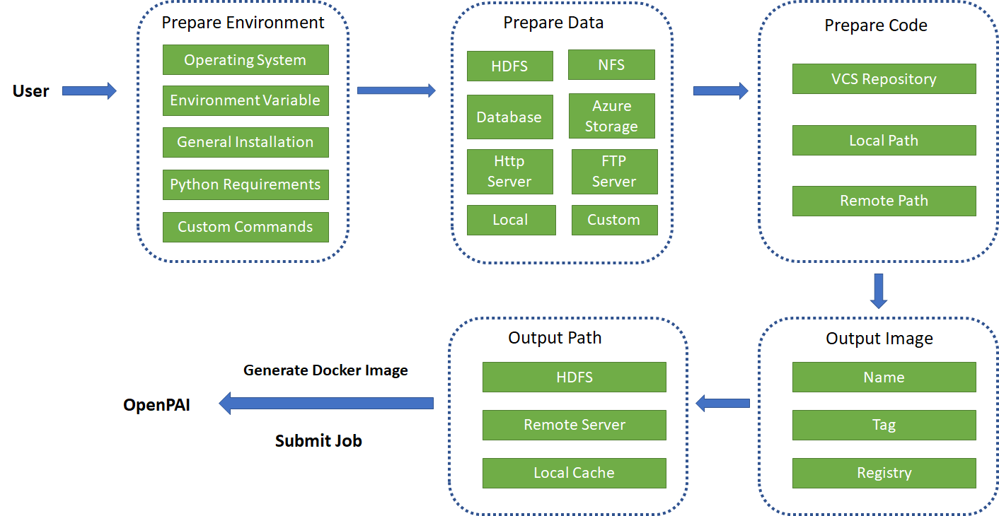
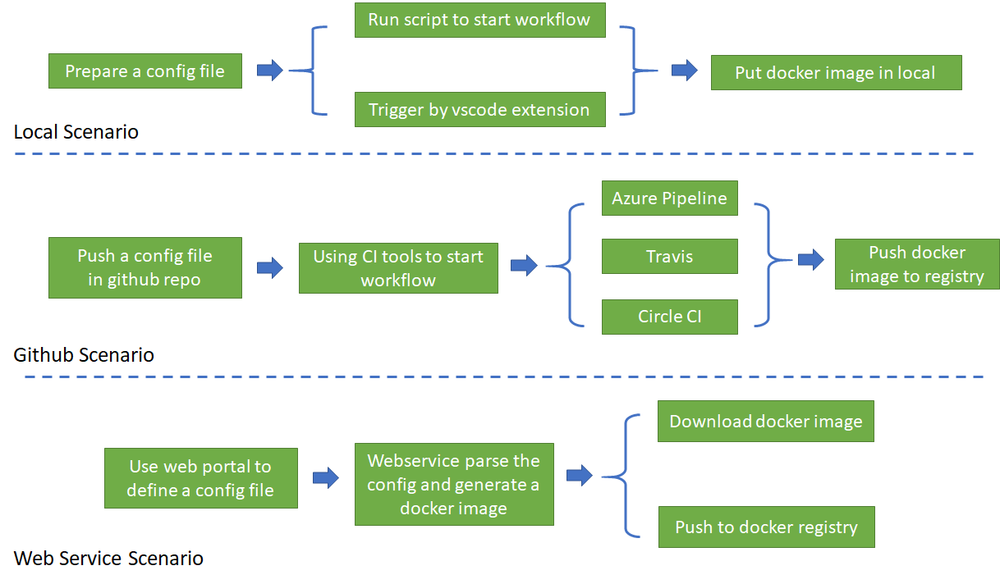

# PAIFlow

PAIFlow is a workflow integration for [Microsoft OpenPAI](https://github.com/Microsoft/pai). It is responsible for preparation process before submitting jobs to OpenPAI. The PAIFlow will generate a docker image based on the user config. The docker image will take care of the environment, data and code, leaving OpenPAI focused on job execution.

## Workflow Process

The work flow is shown as below. User should config environment, data, code and output in sequence. And PAIFlow will generate a docker image based on the config. This image will be lauched in OpenPAI for user's training job.

## User Scenarios

There are 3 user scenarios in Workflow: local, github and web service.

In the local senario, user should write a config file following [config schema](./config_schema.md) in advance, then either run a script or use vscode extension to generate the docker image.

In the github scenario, user should push a config file to base directory of github repository. PAIFlow will provide 3 CI tools for user: Azure Pipeline, Travis and Circle CI. Whichever CI tool is used, it has to be installed in this github by user. Then PAIFlow will provide a config file and runn build process to generate a docker image as output artifact.

In the web service scenario, user could deploy a PAIFlow service along with deploying OpenPAI. The service will provide a web portal for user to set the config and send work flow request to service. After docker image generated, it can be downloaded or pushed to a registry directly by web service.

